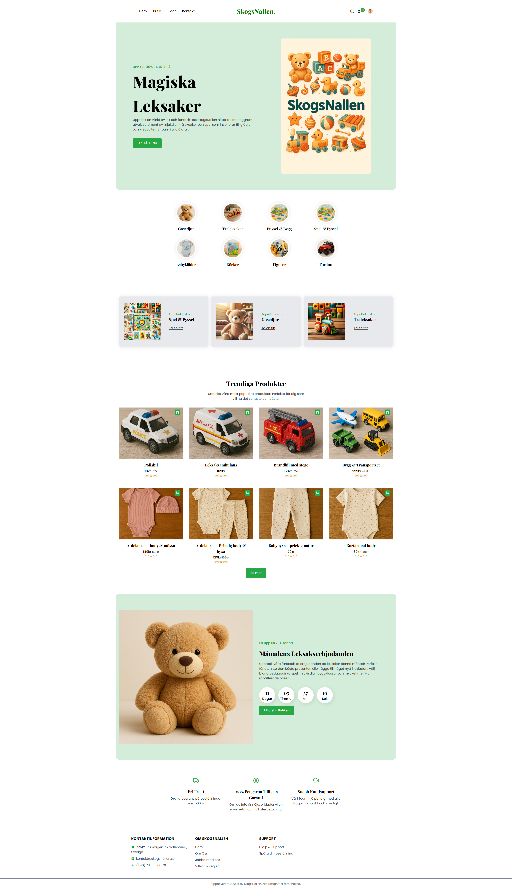
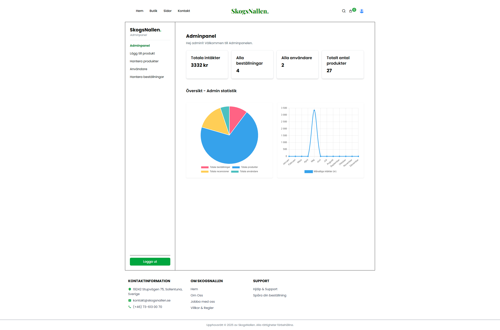
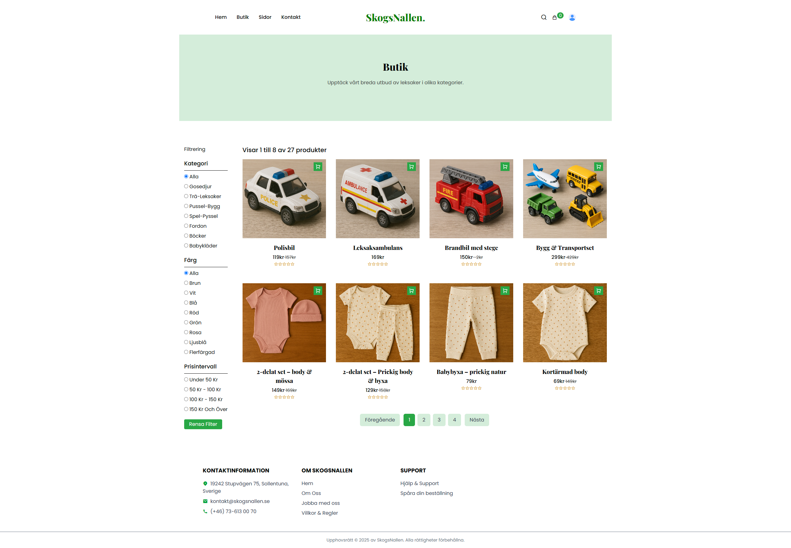

<h1 align="center">🧸 SkogsNallen – E‑commerce Toy Store</h1>
<p align="center">
  <a href="https://skogsnallen-1.onrender.com"><strong>Live Frontend  →</strong></a>
  <br/><br/>
</p>

---

## ✨ What is SkogsNallen?

SkogsNallen is a modern, **responsive** online store where families can discover quality toys, add them to a cart and pay securely with Stripe. Admins get a private dashboard for managing products, orders and users.


---

## 🔗 Live Demo

| Layer          | URL                                                                          |
| -------------- | ---------------------------------------------------------------------------- |
| 🌐 Frontend    | [https://skogsnallen-1.onrender.com](https://skogsnallen-1.onrender.com)     |
| 🖥 Backend API | [https://skogsnallen.onrender.com/api](https://skogsnallen.onrender.com) |

---

## 🚀 Key Features

<details open>
  <summary><strong>Customer experience</strong></summary>

* Browse toys by **category**
* Filter by **price, colour** and **keyword**
* JWT‑powered **signup / login**
* Live **order history & status**
* **Stripe Checkout** 

</details>

<details open>
  <summary><strong>Admin capabilities</strong></summary>

* CRUD products with image upload
* Update & delete any order
* Promote / demote users
* Real‑time dashboard totals (revenue, orders, users)

</details>

---

## 🧰 Tech Stack

| Tier          | Tools                                                                            |
| ------------- | -------------------------------------------------------------------------------- |
| **Frontend**  | React 18 · Redux Toolkit & RTK Query · React Router · Tailwind CSS            |
| **Backend**   | Node.js 20 · Express · MongoDB Atlas + Mongoose · Stripe API · JSON Web Tokens |
| **Utilities** | Multer + Cloudinary for image uploads                                            |

---

## 📦 Getting Started

### 1  Clone & Install

```bash
# Clone
$ git clone https://github.com/Darougah/SkogsNallen.git
$ cd SkogsNallen

# Backend deps
$ cd backend && npm install

# Frontend deps
$ cd ../frontend && npm install
```

### 2  Environment Variables

<details open>
  <summary><code>backend/.env</code></summary>

```env
PORT=5000
DB_URL=your‑mongodb‑connection‑url
JWT_SECRET=your‑jwt‑secret
STRIPE_SECRET_KEY=your‑stripe‑secret
CLOUDINARY_CLOUD_NAME=your‑cloud‑name
CLOUDINARY_API_KEY=xxx
CLOUDINARY_API_SECRET=xxx
```

</details>

<details open>
  <summary><code>frontend/.env</code></summary>

```env
VITE_STRIPE_PK=your‑stripe‑publishable‑key
```

</details>

### 3  Run locally

```bash
# Start backend
$ cd backend && npm run dev

# Start frontend (new terminal)
$ cd frontend && npm run dev
```

Navigate to [http://localhost:5173](http://localhost:5173) and start playing!

---

## 🧾 API Reference

<details open>
  <summary><strong>👤 Users / Auth</strong></summary>

| Method | Endpoint                 | Description                |
| ------ | ------------------------ | -------------------------- |
| POST   | `/api/auth/register`     | Register new user          |
| POST   | `/api/auth/login`        | Log in user                |
| POST   | `/api/auth/logout`       | Log out current user       |
| GET    | `/api/auth/users`        | Get all users *(admin)*    |
| DELETE | `/api/auth/users/:id`    | Delete a user *(admin)*    |
| PUT    | `/api/auth/users/:id`    | Update user role *(admin)* |
| PATCH  | `/api/auth/edit-profile` | Update own profile         |

</details>

<details open>
  <summary><strong>🛒 Products</strong></summary>

| Method | Endpoint                    | Description                |
| ------ | --------------------------- | -------------------------- |
| POST   | `/api/products`             | Create a product *(admin)* |
| GET    | `/api/products`             | Fetch all products         |
| GET    | `/api/products/:id`         | Fetch single product       |
| PUT    | `/api/products/:id`         | Update product *(admin)*   |
| DELETE | `/api/products/:id`         | Delete product *(admin)*   |
| GET    | `/api/products/related/:id` | Related products           |

</details>

<details open>
  <summary><strong>⭐ Reviews</strong></summary>

| Method | Endpoint       | Description     |
| ------ | -------------- | --------------- |
| POST   | `/api/reviews` | Submit a review |

</details>

<details open>
  <summary><strong>📦 Orders</strong></summary>

| Method | Endpoint                              | Description                   |
| ------ | ------------------------------------- | ----------------------------- |
| POST   | `/api/orders/create-checkout-session` | Start Stripe checkout         |
| GET    | `/api/orders`                         | Get all orders *(admin)*      |
| PATCH  | `/api/orders/update-order-status/:id` | Update order status *(admin)* |

</details>


---

## 🖼 Screenshots

| Home                           | Admin                            | Product                              |
| ------------------------------ | -------------------------------- | ------------------------------------ |
|  |  |  |

---


## 👨‍💻 Author

Made with ❤️ by **Daniel Darougah** – 2025
